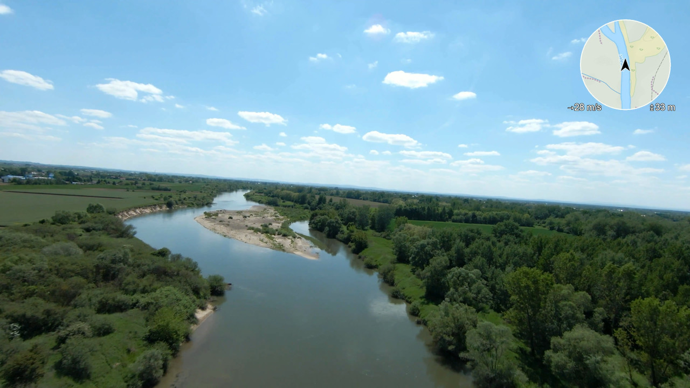

# FPV OSD Map Generator

This script is intended to **render maps into video files from DJI FPV drones**. It overlays map tiles and optional subtitles onto FPV (First-Person View) video footage. The tool supports multiple tile providers and can either accept manual file input or automatically detect files in a designated folder.

##



## 📦 Requirements

Make sure you have Python 3.8+ installed.

Install dependencies with:

```bash
pip install -r requirements.txt
```

## 🚀 Usage

```bash
python fpv_osd.py [OPTIONS]
```

### 🔧 Arguments

| Argument            | Description                                                                 |
|---------------------|-----------------------------------------------------------------------------|
| `--files`           | One or more MP4 video files to process (e.g., `--files video1.mp4 video2.mp4`) |
| `--subtitles`       | One or more SRT subtitle files (optional)                                  |
| `--autodetect`      | Automatically detect MP4 and SRT files in the `data/` directory             |
| `--tile-provider`   | Select a tile provider: `opentopomap`, `google`, `thunderforest`, `thunderforest_landscape` (default: `thunderforest_landscape`) |

> **Note:** You must provide either `--files` or `--autodetect`. Using both is not allowed.

### 🌐 Tile Providers

The script supports several map tile providers for visual overlays:

- `opentopomap`: OpenTopoMap
- `google`: Google Satellite Tiles
- `thunderforest`: Thunderforest Outdoors *(requires API key via `THUNDERFOREST_API_KEY` environment variable)*
- `thunderforest_landscape`: Thunderforest Landscape *(requires API key)*

### 📁 Autodetect Mode

If you use `--autodetect`, the script will look for `.mp4` and `.srt` files (case-insensitive) in the `data/` directory.

Example:

```bash
python fpv_osd.py --autodetect
```

### 📌 Example Manual Mode

```bash
python fpv_osd.py --files flight1.mp4 flight2.MP4 --subtitles flight1.srt flight2.srt --tile-provider opentopomap
```

## 🔐 API Keys

If you use Thunderforest tiles, set the API key as an environment variable:

```bash
export THUNDERFOREST_API_KEY=your_api_key_here  # Linux/macOS
set THUNDERFOREST_API_KEY=your_api_key_here     # Windows (cmd)
```

## 📝 License

MIT License
